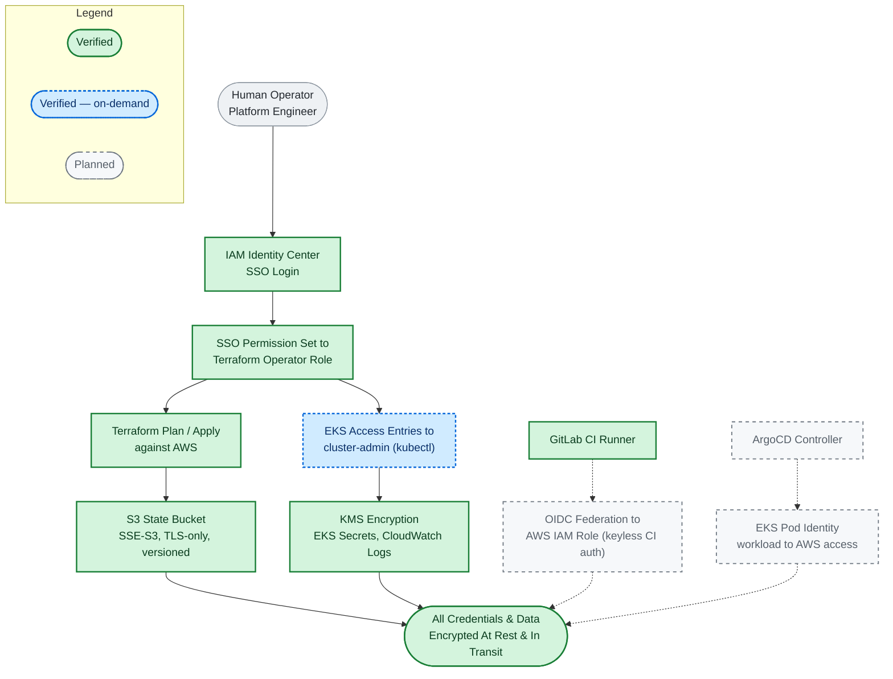

# PlatformBox Architecture Diagrams

These diagrams are capability evidence for the PlatformBox Launch product —
used on [platformbox.io](https://www.platformbox.io) and in LinkedIn posts.
They're drawn from the applied Terraform state of the reference
implementation (`platformbox-idp`), not from the product roadmap, so every
"verified" claim below is checkable against a real ADR and real AWS state,
not just prose.

> **Reading these diagrams:** 🟢 solid green = verified, built and applied in
> AWS, checked today · 🔵 dashed blue = verified but on-demand (built and
> proven, then intentionally torn down between sessions) · ⚪ dashed grey =
> target state, not yet built. Each diagram repeats its own legend so it
> reads correctly even cropped on its own (e.g. for LinkedIn).

## 1. Golden Path — Developer Flow

The infrastructure half of this path is real today: a `git push` genuinely
flows through CI validation into an applied AWS environment. The application
half — building and deploying a workload through the platform — is the
target we're building next.

```mermaid
flowchart LR
    classDef verified  fill:#d4f4dd,stroke:#1a7f37,stroke-width:2px,color:#0b3d1f;
    classDef ephemeral fill:#d0ebff,stroke:#0969da,stroke-width:2px,stroke-dasharray:4 3,color:#0a3069;
    classDef planned   fill:#f6f8fa,stroke:#6e7781,stroke-width:1.5px,stroke-dasharray:5 5,color:#57606a;
    classDef neutral   fill:#eef1f4,stroke:#8c959f,stroke-width:1px,color:#24292f;

    subgraph Legend["Legend"]
        direction LR
        L1(["Verified — built & applied in AWS"])
        L2(["Verified — on-demand"])
        L3(["Planned — not yet built"])
    end

    Dev(["Developer / Platform Operator"])
    Repo["Git Repository<br/>GitLab — platformbox-idp"]
    Validate["CI Validate Stage<br/>pre-commit + tflint + Trivy (IaC scan)"]
    Apply["Terraform Apply<br/>human, via IAM Identity Center SSO"]
    Infra["AWS Infrastructure<br/>VPC, EKS, GuardDuty, KMS"]

    AppCI["CI: App Build + Container Image Scan"]
    Registry["Amazon ECR"]
    GitOps["ArgoCD GitOps Reconciliation"]
    Deploy["Workload Deployed to EKS Fargate"]
    Running["Running Application Service"]
    Monitor["Application Monitoring<br/>kube-prometheus-stack"]

    Dev -->|git push| Repo --> Validate --> Apply --> Infra
    Infra -.-> AppCI -.-> Registry -.-> GitOps -.-> Deploy -.-> Running -.-> Monitor

    class L1,Dev,Repo,Validate,Apply verified
    class Infra,L2 ephemeral
    class L3,AppCI,Registry,GitOps,Deploy,Running,Monitor planned
    class Dev neutral
```

*Today the Golden Path is proven end-to-end for infrastructure changes only.
Nothing past "AWS Infrastructure" exists yet — no application CI, no
registry, no GitOps controller, no deployed workload.*

## 2. Platform Infrastructure

Six layers, matching how the reference implementation is actually organized:
network, compute, delivery, security, observability, and the Terraform that
provisions all of it.

```mermaid
flowchart TD
    classDef verified  fill:#d4f4dd,stroke:#1a7f37,stroke-width:2px,color:#0b3d1f;
    classDef ephemeral fill:#d0ebff,stroke:#0969da,stroke-width:2px,stroke-dasharray:4 3,color:#0a3069;
    classDef planned   fill:#f6f8fa,stroke:#6e7781,stroke-width:1.5px,stroke-dasharray:5 5,color:#57606a;

    subgraph Legend["Legend"]
        direction LR
        L1(["Verified — built & applied"])
        L2(["Verified — on-demand"])
        L3(["Planned — not yet built"])
    end

    subgraph NetworkLayer["Network Layer — VPC (eu-south-2)"]
        VPC["VPC<br/>10.0.0.0/16"]
        PubA["Public Subnet<br/>10.0.0.0/24 (eu-south-2a)"]
        PubB["Public Subnet<br/>10.0.1.0/24 (eu-south-2b)"]
        PrivA["Private Subnet<br/>10.0.10.0/24 (eu-south-2a)"]
        PrivB["Private Subnet<br/>10.0.11.0/24 (eu-south-2b)"]
        IGW["Internet Gateway"]
        NAT["Shared NAT Instance<br/>t4g.nano · ARM64 · IMDSv2"]
        FlowLogs["VPC Flow Logs<br/>30-day retention"]
        VPC --> PubA & PubB & PrivA & PrivB
        IGW --> PubA & PubB
        PubA --> NAT
        NAT --> PrivA & PrivB
        VPC --> FlowLogs
    end

    subgraph ComputeLayer["Compute Layer — Kubernetes (EKS)"]
        EKS["EKS Cluster v1.36<br/>Fargate-only, apply-up / destroy-down"]
        FPSys["Fargate Profile: kube-system"]
        FPDefault["Fargate Profile: default"]
        AccessEntries["EKS Access Entries<br/>SSO Admin Role to cluster-admin"]
        SecretsEnc["K8s Secrets<br/>Envelope Encryption"]
        PodIdentity["EKS Pod Identity<br/>workload to AWS access"]
        EKS --> FPSys & FPDefault
        AccessEntries --> EKS
        EKS --> SecretsEnc
        FPDefault -.-> PodIdentity
    end

    subgraph CICDLayer["CI/CD & Delivery Layer"]
        GitLabRepo["GitLab Repository<br/>platformbox-idp"]
        CIRunners["GitLab SaaS CI Runners"]
        CIValidate["Validate Stage<br/>pre-commit, tflint, Trivy (IaC scan)"]
        CIOIDC["OIDC Federation<br/>CI to AWS IAM Role"]
        AppBuildScan["App Build + Container<br/>Image Scan (Trivy)"]
        ECR["Amazon ECR"]
        ArgoCD["ArgoCD GitOps Controller"]
        GitLabRepo --> CIRunners --> CIValidate
        CIOIDC -.-> AppBuildScan -.-> ECR -.-> ArgoCD
    end

    subgraph SecurityLayer["Security Layer"]
        SSO["IAM Identity Center<br/>Human SSO — Terraform operator"]
        StateBucket["Terraform State Bucket<br/>SSE-S3, TLS-only, versioned, S3 native lock"]
        KMS["Customer-Managed KMS Keys<br/>EKS secrets, log encryption"]
        GuardDuty["Amazon GuardDuty<br/>foundational protections"]
        AWSConfig["AWS Config"]
        SSO --> AccessEntries
    end

    subgraph ObservabilityLayer["Observability Layer"]
        CWLogs["Amazon CloudWatch Logs<br/>VPC Flow Logs + EKS control-plane logs<br/>KMS-encrypted"]
        KubeProm["kube-prometheus-stack<br/>cluster + application metrics"]
        FlowLogs --> CWLogs
        EKS --> CWLogs
        FPDefault -.-> KubeProm
    end

    subgraph IaCLayer["Infrastructure-as-Code Layer"]
        Bootstrap["terraform/bootstrap<br/>state bucket, local-state exception"]
        ModNetwork["terraform/modules/network"]
        ModEKS["terraform/modules/eks"]
        ModSecurity["terraform/modules/security"]
        EnvDev["terraform/environments/dev"]
        ModECR["terraform/modules/ecr<br/>(scaffold only, empty)"]
        ModIAM["terraform/modules/iam<br/>(scaffold only, empty)"]
        EnvProd["terraform/environments/prod"]
        Bootstrap --> StateBucket
        ModNetwork & ModEKS & ModSecurity --> EnvDev
        EnvDev --> VPC
        EnvDev --> EKS
        EnvDev --> GuardDuty
        ModECR -.-> EnvDev
        ModIAM -.-> EnvDev
        EnvDev -.-> EnvProd
        CIValidate -->|lints| ModNetwork
    end

    KMS --> SecretsEnc

    class L1,VPC,PubA,PubB,PrivA,PrivB,IGW,NAT,FlowLogs,GitLabRepo,CIRunners,CIValidate,SSO,StateBucket,KMS,GuardDuty,Bootstrap,ModNetwork,ModEKS,ModSecurity,EnvDev,CWLogs verified
    class L2,EKS,FPSys,FPDefault,AccessEntries,SecretsEnc ephemeral
    class L3,CIOIDC,AppBuildScan,ECR,ArgoCD,PodIdentity,AWSConfig,KubeProm,ModECR,ModIAM,EnvProd planned
```

*Network, security, IaC, and the CI validate stage are real and applied
today. The EKS cluster is genuinely built and `kubectl`-verified (dashed
blue) but run on-demand rather than continuously — see ADR-007. CI/CD
delivery, GitOps, and application-level observability (dashed grey) are the
target we're building toward next.*

## 3. Security & Auth Flow

What's actually true about credentials today, versus what's designed for but
not yet wired up.

*Human access to AWS runs entirely through IAM Identity Center SSO today —
no long-lived credential exists anywhere in this path. Machine-to-AWS auth
for CI/CD (OIDC) and for workloads (Pod Identity) follows the same keyless
design, but isn't wired up yet because there's no CI/CD pipeline or workload
to authenticate.*

## Source of truth

Every "verified" claim above traces to a specific ADR in
[`platformbox-idp/docs/decisions/`](https://gitlab.com/platform-box-group/platformbox-idp/-/tree/main/docs/decisions):
ADR-002 (NAT cost strategy), ADR-003 (state architecture), ADR-005 (network
IP plan), ADR-006 (NAT hardening), ADR-007 (EKS architecture and its
apply-up/destroy-down lifecycle), ADR-008 (security baseline).
